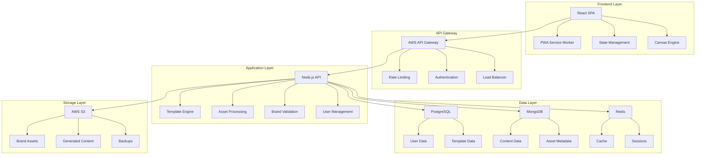
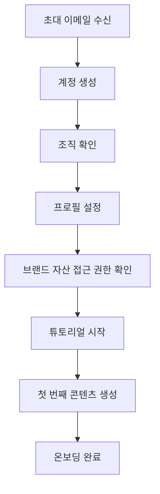
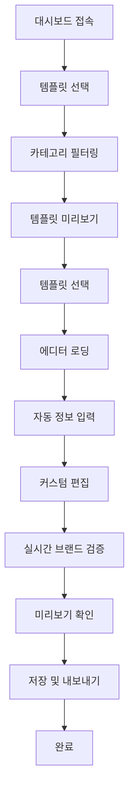
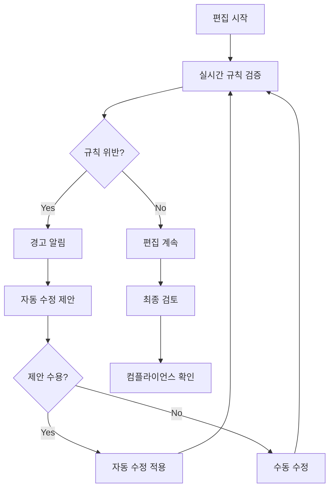

# Brand Studio PRD (Product Requirements Document)

## 1. 프로젝트 개요

### 비전 및 미션

**비전**
> 모든 딜러가 전문적이고 일관된 브랜드 콘텐츠를 5분 내에 제작할 수 있는 세상을 만든다.

**미션**
> 브랜드 자산 선택만으로 딜러들이 전문가급 마케팅 콘텐츠를 제작할 수 있는 직관적이고 효율적인 플랫폼을 제공한다.

### 핵심 가치 제안

1. **즉시 사용 가능한 브랜드 컴플라이언스**
   - 편집 과정에서 실시간 브랜드 가이드라인 자동 검증
   - 승인 절차 없이도 브랜드 표준 준수 보장

2. **딜러 특화 사용자 경험**
   - 디자인 지식 없이도 5분 내 콘텐츠 완성
   - 모바일 우선 반응형 인터페이스

3. **개인화된 자동화**
   - 지역별, 제품별 정보 자동 연동
   - AI 기반 맞춤형 템플릿 추천

4. **멀티 채널 최적화**
   - 하나의 콘텐츠로 다양한 포맷 자동 생성
   - SNS, 인쇄물, 디지털 광고 동시 대응

### 타겟 사용자

#### 주요 사용자 (Primary Users)
- **딜러 (Dealer)**: 브랜드 제품 판매 담당자
- **지역 마케터**: 지역별 마케팅 활동 담당자
- **세일즈 매니저**: 영업팀 콘텐츠 제작 책임자

#### 보조 사용자 (Secondary Users)
- **브랜드 매니저**: 브랜드 자산 및 가이드라인 관리
- **마케팅 관리자**: 템플릿 승인 및 전략 수립
- **IT 관리자**: 시스템 관리 및 권한 설정

## 2. 문제 정의 및 솔루션

### 해결하고자 하는 문제

#### 현재 딜러들이 겪는 주요 문제점

1. **브랜드 일관성 유지의 어려움**
   - 브랜드 가이드라인 준수 검증 과정 복잡
   - 멀티 채널 배포 시 포맷별 일관성 관리 어려움
   - 승인 프로세스 지연으로 인한 기회 손실

2. **전문 도구 사용의 접근성 문제**
   - Adobe, Figma 등 전문 도구의 높은 학습 곡선
   - 디자인 지식 없는 딜러들의 콘텐츠 제작 어려움
   - 간단한 수정에도 외부 도움 필요

3. **효율성 및 생산성 저하**
   - 콘텐츠 제작 시간 과도하게 소요 (평균 2-3시간)
   - 반복적인 수작업으로 인한 생산성 저하
   - 지역별, 제품별 개인화 작업의 비효율성

4. **비용 및 리소스 문제**
   - 외부 디자이너 의존으로 인한 높은 비용
   - 여러 도구 구독료 부담
   - 콘텐츠 제작 지연으로 인한 기회비용

### 제안하는 솔루션

#### Brand Studio 핵심 솔루션

1. **원클릭 브랜드 컴플라이언스 시스템**
   - 실시간 브랜드 가이드라인 자동 검증
   - 미리 승인된 브랜드 자산 라이브러리
   - 자동 오류 감지 및 수정 제안

2. **딜러 특화 안전한 에디터**
   - 템플릿 구조 보존형 편집 시스템
   - 브랜드 자산 선택 기반 콘텐츠 교체
   - 텍스트 콘텐츠만 수정 가능
   - 모바일 최적화 인터페이스

3. **개인화 자동화 엔진**
   - 지역별, 제품별 정보 자동 연동
   - AI 기반 맞춤형 템플릿 추천
   - 사용 패턴 학습을 통한 개인화

4. **멀티 포맷 동시 생성**
   - 하나의 콘텐츠로 다양한 포맷 자동 생성
   - SNS, 인쇄물, 디지털 광고 최적화
   - 원클릭 다중 채널 배포

### 기대 효과

#### 정량적 효과
- **콘텐츠 제작 시간 80% 단축** (3시간 → 30분)
- **브랜드 컴플라이언스 100% 달성**
- **콘텐츠 제작 비용 70% 절감**
- **딜러 생산성 3배 향상**

#### 정성적 효과
- 딜러들의 마케팅 역량 강화
- 브랜드 이미지 일관성 향상
- 딜러 만족도 및 브랜드 충성도 증가
- 마케팅 캠페인 효과성 극대화

## 3. 기능 요구사항

### 핵심 기능 (우선순위별)

#### Priority 1: 필수 기능 (MVP)

**1. 홈 화면 및 카테고리 선택**
- 카테고리 선택 화면 ('문서', '프로모션 배너', 'SNS')
- 카테고리 클릭 시 에디터로 진입
- 각 카테고리별 기본 템플릿 자동 로드

**2. 에디터 화면**
- **좌측 패널**: 
  - 포맷 선택 (예: A4, 웹 배너, 인스타그램 포스트) - ✅ 구현완료
  - 타이틀 텍스트 입력 (줄바꿈 지원) - ✅ 구현완료
  - 내용 텍스트 입력 (줄바꿈 지원) - ✅ 구현완료
  - 브랜드 자산 선택 (이미지 교체) - ✅ 구현완료
  - 레이아웃 선택 (Default, Bottom Left, Middle 등) - ✅ 구현완료
- **가운데 에디터**: 
  - 템플릿 기반 콘텐츠 미리보기 - ✅ 구현완료
  - 실시간 편집 반영 - ✅ 구현완료
  - 내보내기 버튼 - ✅ 구현완료
  - 텍스트 스택 레이아웃 (타이틀/서브타이틀 자동 정렬) - ✅ 구현완료
  - 배경 이미지 밝기에 따른 텍스트 색상 자동 조정 (Promotion Banner) - ✅ 구현완료

**3. 브랜드 허브**
- 브랜드 자산 업로드 기능 - ✅ 구현완료
- 업로드된 자산 목록 보기 - ✅ 구현완료
- 자산 카테고리 관리 (로고, 제품 이미지, 배경 등) - ✅ 구현완료
- 자산 삭제 및 수정 - ✅ 구현완료
- 프리셋 이미지 제공 - ✅ 구현완료

#### Priority 2: 중요 기능

**1. 고급 에디터 기능**
- 레이어 관리 및 정렬
- 고급 텍스트 효과 (그림자, 테두리) - ✅ 텍스트 그림자 구현완료
- 이미지 필터 및 효과
- 도형 및 아이콘 삽입
- 포맷별 차량 이미지 크기 자동 조정 - ✅ 구현완료 (1.4배 확대)
- 포맷별 레이아웃 최적화 - ✅ 구현완료
- 저장 기능 최적화 (localStorage 할당량 관리) - ✅ 구현완료

**2. 자동화 기능**
- 지역별 정보 자동 연동
- 제품 정보 자동 삽입
- 템플릿 자동 추천
- 일괄 콘텐츠 생성

**3. 브랜드 컴플라이언스**
- 실시간 가이드라인 검증
- 자동 오류 감지 및 알림
- 브랜드 규칙 위반 방지
- 승인 워크플로우

**4. 협업 기능**
- 실시간 공동 편집
- 댓글 및 피드백 시스템
- 버전 관리 및 이력 추적
- 공유 및 권한 관리

#### Priority 3: 부가 기능

**1. AI 기반 기능**
- 자동 레이아웃 최적화
- 텍스트 자동 생성
- 이미지 자동 크롭핑
- 색상 조합 추천

**2. 고급 분석**
- 콘텐츠 성과 분석
- 사용 패턴 분석
- ROI 측정 및 보고
- 대시보드 제공

**3. 통합 기능**
- 외부 시스템 연동 (CRM, ERP)
- API 제공
- 웹훅 지원
- 타사 도구 연동

### 상세 기능 명세

#### 1. 홈 화면 및 카테고리 시스템

**1.1 카테고리 구조**
```typescript
interface Category {
  id: string;
  name: '문서' | '프로모션 배너' | 'SNS';
  icon: string;
  description: string;
  defaultTemplate: string; // 기본 템플릿 ID
}

interface HomePage {
  categories: Category[];
  recentContents?: Content[]; // MVP 후 추가 가능
}
```

#### 2. 에디터 시스템

**2.1 에디터 레이아웃**
```typescript
interface EditorLayout {
  leftPanel: {
    formatSelector: FormatOption[];
    titleInput: TextInput;
    contentInput: TextAreaInput;
    assetSelector: AssetSelectorComponent;
  };
  canvas: {
    template: Template;
    preview: CanvasPreview;
    exportButton: ExportAction;
  };
}

interface FormatOption {
  id: string;
  name: string; // 예: 'A4', '웹 배너', '인스타그램 포스트'
  dimensions: { width: number; height: number };
  category: '문서' | '프로모션 배너' | 'SNS';
}
```

**2.2 템플릿 구조**
```typescript
interface Template {
  id: string;
  name: string;
  category: 'document' | 'banner' | 'social' | 'print';
  subcategory: string;
  thumbnail: string;
  canvas: CanvasData;
  variables: TemplateVariable[];
  brandRules: BrandRule[];
  tags: string[];
  createdAt: Date;
  updatedAt: Date;
}

interface TemplateVariable {
  id: string;
  name: string;
  type: 'text' | 'image' | 'color' | 'data';
  defaultValue: any;
  constraints: VariableConstraints;
}
```

**2.3 편집 가능 요소**
```typescript
interface EditableElement {
  id: string;
  type: 'title' | 'content' | 'image';
  value: string | ImageAsset;
  constraints: {
    maxLength?: number; // 텍스트의 경우
    allowedAssetTypes?: AssetType[]; // 이미지의 경우
  };
}
```

#### 3. 브랜드 허브 시스템

**3.1 브랜드 허브 구조**
```typescript
interface BrandHub {
  assets: BrandAsset[];
  categories: AssetCategory[];
  uploadCapability: boolean;
}

interface BrandAsset {
  id: string;
  name: string;
  type: 'logo' | 'product' | 'background' | 'icon';
  url: string;
  thumbnailUrl: string;
  category: string;
  uploadedBy: string;
  uploadedAt: Date;
  fileSize: number;
  dimensions?: { width: number; height: number };
}

interface AssetCategory {
  id: string;
  name: string; // 예: '로고', '제품 이미지', '배경'
  assetCount: number;
}
```

**3.2 자산 업로드 기능**
```typescript
interface AssetUpload {
  acceptedFormats: ['jpg', 'jpeg', 'png'];
  maxFileSize: number; // MB
  validationRules: {
    minDimensions?: { width: number; height: number };
    maxDimensions?: { width: number; height: number };
  };
}

// 구현된 내보내기 포맷
interface ExportFormats {
  supportedFormats: ['png', 'jpg', 'pdf']; // SVG 제거, PDF 추가
  qualityOptions: {
    jpg: [70, 80, 90, 100]; // JPG 품질 옵션
  };
  defaultFileName: string; // 템플릿명_날짜 형식
}
```

**3.3 자산 관리 기능**
- **업로드**: 이미지 파일 업로드 및 카테고리 지정
- **목록 보기**: 카테고리별 자산 필터링 및 검색
- **삭제**: 업로드한 자산 삭제
- **수정**: 자산 이름 및 카테고리 수정


### 사용자 스토리

#### MVP 사용자 스토리

**Story 1: 카테고리 선택 및 콘텐츠 생성** - ✅ 구현완료
```
As a 딜러
I want to 홈 화면에서 카테고리를 선택하고 에디터에서 콘텐츠를 생성하고
So that 빠르고 쉽게 브랜드 콘텐츠를 만들 수 있다.

Acceptance Criteria:
- 홈 화면에서 '문서', '프로모션 배너', 'SNS' 카테고리 선택 가능 - ✅
- 카테고리 클릭 시 에디터로 자동 진입 - ✅
- 좌측 패널에서 포맷, 타이틀, 내용 편집 가능 - ✅
- 브랜드 자산에서만 이미지 선택 가능 - ✅
- 포맷 변경 시 사용자 선택 이미지 유지 - ✅
```

**Story 2: 제한적 편집 기능** - ✅ 구현완료
```
As a 딜러
I want to 템플릿의 텍스트와 이미지만 편집하고
So that 브랜드 가이드라인을 준수하면서 콘텐츠를 생성할 수 있다.

Acceptance Criteria:
- 템플릿 요소 위치 및 크기 고정 - ✅
- 타이틀과 내용 텍스트만 편집 가능 - ✅
- 이미지는 브랜드 자산에서만 선택/교체 - ✅
- 실시간 미리보기 제공 - ✅
- 텍스트 줄바꿈 지원 - ✅
- 스택 레이아웃으로 텍스트 겹침 방지 - ✅
```

**Story 3: 브랜드 자산 업로드** - ✅ 구현완료
```
As a 브랜드 관리자
I want to 브랜드 허브에서 브랜드 자산을 업로드하고
So that 딜러들이 승인된 자산을 사용할 수 있도록 한다.

Acceptance Criteria:
- 브랜드 허브 메뉴에서 자산 업로드 가능 - ✅
- 이미지 파일 (JPG, PNG) 업로드 지원 - ✅
- 카테고리별 자산 분류 (로고, 제품, 배경 등) - ✅
- 업로드된 자산 목록 확인 및 관리 - ✅
- 프리셋 이미지 자동 제공 - ✅
```

## 4. 비기능 요구사항

### 성능 요구사항

#### 응답 시간
- **페이지 로딩**: 초기 로딩 < 3초, 후속 페이지 < 1초
- **에디터 렌더링**: 템플릿 로딩 < 2초, 객체 조작 < 500ms
- **파일 처리**: 10MB 이미지 업로드 < 30초, 변환 < 5초
- **저장/내보내기**: 콘텐츠 저장 < 1초, 내보내기 < 10초

#### 동시성 및 확장성
- **동시 사용자**: 1,000명 이상 동시 접속 지원
- **동시 편집**: 50명 이상 동시 편집 세션 지원
- **파일 저장소**: 1TB 이상 파일 저장 공간
- **트랜잭션 처리**: 초당 100TPS 이상 처리 가능

#### 가용성
- **시스템 가동률**: 99.9% 이상 (월간 43분 이하 다운타임)
- **데이터 백업**: 실시간 백업 및 24시간 이내 복구
- **재해 복구**: RTO 4시간, RPO 1시간 이내

### 보안 요구사항

#### 데이터 보안 및 감사
```typescript
// 보안 요구사항 구현
interface SecurityRequirements {
  dataProtection: {
    encryption: {
      atRest: 'AES-256';
      inTransit: 'TLS 1.3';
    };
    compliance: ['GDPR', 'CCPA', 'K-ISMS'];
  };
  auditLogging: {
    contentCreation: boolean; // 콘텐츠 생성 기록
    assetUsage: boolean; // 브랜드 자산 사용 기록
    exportHistory: boolean; // 내보내기 이력 기록
  };
}
```

#### 데이터 보안
- **전송 암호화**: TLS 1.3 이상 사용
- **저장 암호화**: AES-256 암호화 적용
- **브랜드 자산 보호**: 승인된 자산만 접근 가능
- **감사 로그**: 콘텐츠 생성 및 자산 사용 이력 기록

#### 개인정보 보호
- **GDPR 준수**: 개인정보 수집/처리 동의 관리
- **데이터 최소화**: 필요한 최소한의 데이터만 수집
- **삭제 권리**: 사용자 요청 시 30일 이내 데이터 삭제
- **국경 간 데이터 전송**: 적절한 보호 조치 적용

### 확장성 및 가용성

#### 수평 확장성
```yaml
# 확장성 아키텍처
apiVersion: v1
kind: Service
metadata:
  name: brand-studio-api
spec:
  selector:
    app: brand-studio-api
  ports:
  - port: 8000
    targetPort: 8000
  type: LoadBalancer
---
apiVersion: apps/v1
kind: Deployment
metadata:
  name: brand-studio-api
spec:
  replicas: 3
  selector:
    matchLabels:
      app: brand-studio-api
  template:
    metadata:
      labels:
        app: brand-studio-api
    spec:
      containers:
      - name: api
        image: brand-studio:latest
        ports:
        - containerPort: 8000
        resources:
          requests:
            memory: "512Mi"
            cpu: "500m"
          limits:
            memory: "1Gi"
            cpu: "1000m"
```

#### 로드 밸런싱
- **Application Load Balancer**: 지능형 요청 분산
- **Auto Scaling**: CPU/메모리 사용률 기반 자동 확장
- **CDN**: 전 세계 엣지 로케이션 활용
- **캐싱**: Redis 클러스터 기반 분산 캐싱

## 5. 기술 아키텍처

### 시스템 구조도



### 구현된 기능 상세

#### 핵심 기능 구현 현황

**1. 에디터 기능**
- 포맷별 레이아웃 최적화 (Horizontal, Vertical, Square Banner)
- 텍스트 스택 레이아웃으로 타이틀/서브타이틀 겹침 방지
- 포맷 변경 시 사용자 선택 이미지 유지
- 레이아웃별 텍스트 위치 자동 조정
- 포맷별 폰트 크기 최적화 (Vertical Banner: 42px, 기타: 48px)
- 배경 이미지 밝기에 따른 텍스트 색상 자동 조정 (Promotion Banner)

**2. 내보내기 기능**
- PNG, JPG, PDF 포맷 지원 (SVG 제거)
- Export Dialog UI 개선 (3열 그리드 레이아웃)
- 기본 파일명 자동 입력 (템플릿명_날짜)
- JPG 품질 선택 옵션

**3. 저장 기능 최적화**
- localStorage 할당량 최적화 (썸네일 품질 30%, 스케일 0.5x)
- QuotaExceededError 해결

### 기술 스택 선택 근거

#### Frontend 기술 스택
```typescript
// 선택된 기술 스택과 근거
const frontendStack = {
  framework: {
    choice: 'React 18 + TypeScript',
    reasons: [
      '성숙한 생태계와 풍부한 라이브러리',
      '컴포넌트 기반 재사용성',
      '타입 안정성으로 런타임 오류 방지',
      '대규모 커뮤니티 지원'
    ]
  },
  stateManagement: {
    choice: 'Redux Toolkit + Zustand',
    reasons: [
      'RTK Query로 서버 상태 관리 효율성',
      'Zustand로 로컬 상태 간단 관리',
      '개발자 도구 우수한 디버깅 지원'
    ]
  },
  canvasEngine: {
    choice: 'Fabric.js',
    reasons: [
      '강력한 캔버스 조작 기능',
      '객체 기반 인터페이스',
      '확장 가능한 아키텍처',
      '활발한 커뮤니티'
    ]
  },
  styling: {
    choice: 'Material-UI + Styled-Components',
    reasons: [
      'MUI로 빠른 프로토타이핑',
      'Styled-Components로 커스텀 스타일링',
      '테마 시스템 지원',
      '반응형 디자인 용이성'
    ]
  }
};
```

#### Backend 기술 스택
```typescript
const backendStack = {
  runtime: {
    choice: 'Node.js 18 + TypeScript',
    reasons: [
      'Frontend와 동일 언어로 개발 효율성',
      '비동기 I/O 처리 우수',
      '풍부한 npm 생태계',
      '빠른 개발 속도'
    ]
  },
  framework: {
    choice: 'Express.js',
    reasons: [
      '간단하고 유연한 구조',
      '미들웨어 생태계 풍부',
      '커뮤니티 지원 우수',
      '성능과 안정성 입증'
    ]
  },
  authentication: {
    choice: 'JWT + Passport.js',
    reasons: [
      '무상태 인증으로 확장성 우수',
      '다양한 인증 전략 지원',
      '마이크로서비스 아키텍처 적합',
      '모바일 앱 지원 용이'
    ]
  },
  fileProcessing: {
    choice: 'Sharp + node-canvas',
    reasons: [
      '고성능 이미지 처리',
      '서버사이드 렌더링 지원',
      '다양한 포맷 지원',
      '메모리 효율성 우수'
    ]
  }
};
```

### 데이터 모델

#### 사용자 및 조직 모델
```typescript
// 사용자 데이터 모델
interface User {
  id: string;
  email: string;
  passwordHash: string;
  name: string;
  role: UserRole;
  organizationId: string;
  profile: UserProfile;
  preferences: UserPreferences;
  createdAt: Date;
  updatedAt: Date;
  lastLoginAt: Date;
}

interface Organization {
  id: string;
  name: string;
  brandId: string;
  settings: OrganizationSettings;
  members: string[]; // User IDs
  createdAt: Date;
  updatedAt: Date;
}

interface Brand {
  id: string;
  name: string;
  assets: BrandAsset[];
  guidelines: BrandGuideline[];
  colorPalette: ColorPalette;
  typography: Typography;
  createdAt: Date;
  updatedAt: Date;
}
```

#### 콘텐츠 및 템플릿 모델
```typescript
// 콘텐츠 데이터 모델
interface Content {
  id: string;
  name: string;
  type: ContentType;
  templateId: string;
  ownerId: string;
  organizationId: string;
  canvas: CanvasData;
  variables: ContentVariable[];
  status: ContentStatus;
  metadata: ContentMetadata;
  versions: ContentVersion[];
  createdAt: Date;
  updatedAt: Date;
}

interface Template {
  id: string;
  name: string;
  description: string;
  category: TemplateCategory;
  subcategory: string;
  brandId: string;
  canvas: CanvasData;
  variables: TemplateVariable[];
  brandRules: BrandRule[];
  tags: string[];
  thumbnail: string;
  isPublic: boolean;
  usage: TemplateUsage;
  createdAt: Date;
  updatedAt: Date;
}
```

#### 브랜드 자산 모델
```typescript
// 브랜드 자산 데이터 모델
interface BrandAsset {
  id: string;
  name: string;
  type: AssetType;
  url: string;
  thumbnailUrl: string;
  brandId: string;
  category: string;
  tags: string[];
  metadata: AssetMetadata;
  usage: AssetUsage;
  createdAt: Date;
  updatedAt: Date;
}

interface BrandGuideline {
  id: string;
  brandId: string;
  type: GuidelineType;
  rules: GuidelineRule[];
  priority: 'high' | 'medium' | 'low';
  description: string;
  examples: string[];
  createdAt: Date;
  updatedAt: Date;
}
```

## 6. 사용자 경험

### 사용자 플로우

#### 핵심 사용자 플로우

**1. 딜러 온보딩 플로우**


**2. 콘텐츠 생성 플로우**


**3. 브랜드 컴플라이언스 플로우**


### UI/UX 가이드라인

#### 디자인 시스템

**1. 컬러 팔레트**
```typescript
const colorSystem = {
  primary: {
    main: '#111976d2',
    light: '#42a5f5',
    dark: '#1565c0',
    contrastText: '#ffffff'
  },
  secondary: {
    main: '#dc004e',
    light: '#ff5983',
    dark: '#9a0036',
    contrastText: '#ffffff'
  },
  neutral: {
    50: '#fafafa',
    100: '#f5f5f5',
    200: '#eeeeee',
    300: '#e0e0e0',
    400: '#bdbdbd',
    500: '#9e9e9e',
    600: '#757575',
    700: '#616161',
    800: '#424242',
    900: '#212121'
  },
  semantic: {
    success: '#4caf50',
    warning: '#ff9800',
    error: '#f44336',
    info: '#2196f3'
  }
};
```

**2. 타이포그래피**
```typescript
const typography = {
  fontFamily: [
    'Noto Sans KR',
    'Roboto',
    '-apple-system',
    'BlinkMacSystemFont',
    'sans-serif'
  ].join(','),
  h1: {
    fontSize: '2.5rem',
    fontWeight: 300,
    lineHeight: 1.2
  },
  h2: {
    fontSize: '2rem',
    fontWeight: 400,
    lineHeight: 1.3
  },
  body1: {
    fontSize: '1rem',
    fontWeight: 400,
    lineHeight: 1.5
  },
  button: {
    fontSize: '0.875rem',
    fontWeight: 500,
    textTransform: 'none'
  }
};
```

**3. 컴포넌트 가이드라인**
```typescript
const componentGuidelines = {
  buttons: {
    primary: {
      minHeight: '44px',
      borderRadius: '8px',
      padding: '12px 24px'
    },
    secondary: {
      minHeight: '40px',
      borderRadius: '6px',
      padding: '10px 20px'
    }
  },
  inputs: {
    textField: {
      minHeight: '48px',
      borderRadius: '8px',
      padding: '12px 16px'
    },
    select: {
      minHeight: '48px',
      borderRadius: '8px'
    }
  },
  cards: {
    elevation: 2,
    borderRadius: '12px',
    padding: '24px'
  }
};
```

#### 인터랙션 디자인

**1. 애니메이션 가이드라인**
```typescript
const animations = {
  durations: {
    shortest: 150,
    shorter: 200,
    short: 250,
    standard: 300,
    complex: 375,
    enteringScreen: 225,
    leavingScreen: 195
  },
  easing: {
    easeInOut: 'cubic-bezier(0.4, 0, 0.2, 1)',
    easeOut: 'cubic-bezier(0.0, 0, 0.2, 1)',
    easeIn: 'cubic-bezier(0.4, 0, 1, 1)',
    sharp: 'cubic-bezier(0.4, 0, 0.6, 1)'
  }
};
```

**2. 피드백 시스템**
```typescript
const feedbackSystem = {
  loading: {
    skeleton: '콘텐츠 로딩 중 스켈레톤 UI',
    spinner: '처리 중 로딩 스피너',
    progress: '업로드 진행률 표시'
  },
  success: {
    toast: '성공 메시지 토스트',
    checkmark: '완료 체크마크 애니메이션',
    confirmation: '확인 모달'
  },
  error: {
    inline: '입력 필드 인라인 에러',
    toast: '에러 메시지 토스트',
    banner: '페이지 상단 에러 배너'
  }
};
```

#### 반응형 디자인

**1. 브레이크포인트**
```typescript
const breakpoints = {
  xs: 0,
  sm: 600,
  md: 960,
  lg: 1280,
  xl: 1920
};
```

**2. 레이아웃 시스템**
```typescript
const layoutSystem = {
  container: {
    maxWidth: {
      xs: '100%',
      sm: '540px',
      md: '720px',
      lg: '960px',
      xl: '1140px'
    },
    padding: {
      xs: '16px',
      sm: '24px',
      md: '32px'
    }
  },
  grid: {
    columns: 12,
    spacing: {
      xs: 16,
      sm: 24,
      md: 32
    }
  }
};
```

### 접근성 고려사항

#### 웹 접근성 준수

**1. WCAG 2.1 AA 준수**
```typescript
const accessibilityRequirements = {
  colorContrast: {
    normalText: 4.5,
    largeText: 3.0,
    uiComponents: 3.0
  },
  keyboard: {
    navigation: 'Tab 키로 모든 요소 접근 가능',
    shortcuts: 'Ctrl+S 저장, Ctrl+Z 실행 취소 등',
    focusIndicator: '포커스 시각적 표시'
  },
  screenReader: {
    altText: '모든 이미지에 대체 텍스트 제공',
    ariaLabels: '폼 요소 적절한 라벨 제공',
    landmarks: '페이지 구조 시맨틱 마크업'
  }
};
```

**2. 국제화 지원**
```typescript
const i18nSupport = {
  languages: ['ko', 'en'],
  textDirection: 'ltr',
  dateFormat: {
    ko: 'YYYY년 MM월 DD일',
    en: 'MM/DD/YYYY'
  },
  numberFormat: {
    ko: '1,234,567',
    en: '1,234,567'
  }
};
```

## 7. 개발 계획

### 마일스톤 및 일정

#### Phase 1: MVP 개발 (3개월)

**Month 1: 기초 인프라 및 MVP 기능**
```typescript
const month1Deliverables = {
  week1: [
    '개발 환경 설정',
    '기본 프로젝트 구조 구축',
    '홈 화면 및 카테고리 선택 UI',
    '프론트엔드 라우팅 설정'
  ],
  week2: [
    '에디터 레이아웃 (좌측 패널 + 캔버스)',
    '템플릿 데이터 모델',
    '포맷 선택 기능',
    '텍스트 입력 컴포넌트'
  ],
  week3: [
    '브랜드 허브 페이지',
    '자산 업로드 기능',
    '자산 목록 및 관리 UI',
    '에디터에서 자산 선택 기능'
  ],
  week4: [
    'MVP 기능 통합',
    '기본 테스트',
    '버그 수정',
    '배포 준비'
  ]
};
```

**Month 2: 추가 기능 및 안정화**
```typescript
const month2Deliverables = {
  week1: [
    '내보내기 기능 (PNG, JPG, PDF)', // ✅ 구현완료
    '콘텐츠 저장 기능', // ✅ localStorage 최적화 및 구현완료
    '최근 작업 목록', // ✅ 구현완료
    '모바일 반응형 UI'
  ],
  week2: [
    '성능 최적화', // ✅ localStorage 최적화 구현완료
    '에러 처리 개선', // ✅ QuotaExceededError 해결
    '로딩 상태 개선',
    '사용자 피드백 반영' // ✅ UI/UX 개선 지속 진행
  ],
  week3: [
    '사용자 테스트',
    '버그 수정',
    'UX/UI 개선',
    '성능 테스트'
  ],
  week4: [
    '통합 테스트',
    '보안 점검',
    '배포 준비',
    '문서화'
  ]
};
```

**Month 3: MVP 출시**
```typescript
const month3Deliverables = {
  week1: [
    '최종 테스트',
    '사용자 가이드 작성',
    '배포 환경 설정',
    '모니터링 설정'
  ],
  week2: [
    '베타 테스트',
    '피드백 수집',
    '버그 수정',
    '성능 튜닝'
  ],
  week3: [
    'MVP 출시',
    '사용자 온보딩',
    '초기 모니터링',
    '피드백 분석'
  ],
  week4: [
    '안정화 작업',
    '다음 단계 계획',
    '기능 우선순위 재정의',
    '확장 개발 준비'
  ]
};
```

#### Phase 2: 확장 기능 (6개월)

**고급 기능 개발**
- AI 기반 자동화 기능
- 고급 협업 도구
- 분석 및 리포팅
- 엔터프라이즈 기능

**성능 및 확장성 개선**
- 마이크로서비스 분리
- 성능 최적화
- 글로벌 CDN 배포
- 모바일 앱 개발

### 팀 구성 및 역할

#### 개발팀 구성

**핵심 개발팀 (8명)**
```typescript
const coreTeam = {
  productManager: {
    count: 1,
    responsibilities: [
      '제품 로드맵 관리',
      '요구사항 분석',
      '이해관계자 커뮤니케이션',
      '우선순위 결정'
    ]
  },
  frontendDevelopers: {
    count: 3,
    responsibilities: [
      'React 애플리케이션 개발',
      'UI/UX 구현',
      '캔버스 에디터 개발',
      '모바일 최적화'
    ]
  },
  backendDevelopers: {
    count: 2,
    responsibilities: [
      'Node.js API 개발',
      '데이터베이스 설계',
      '파일 처리 시스템',
      '보안 구현'
    ]
  },
  uxDesigner: {
    count: 1,
    responsibilities: [
      'UI/UX 설계',
      '사용자 리서치',
      '프로토타입 제작',
      '디자인 시스템 관리'
    ]
  },
  devOpsEngineer: {
    count: 1,
    responsibilities: [
      '인프라 구축',
      'CI/CD 관리',
      '모니터링 시스템',
      '보안 관리'
    ]
  }
};
```

**확장 개발팀 (Phase 2)**
```typescript
const expandedTeam = {
  additional: {
    qaEngineer: 1,
    dataEngineer: 1,
    securityEngineer: 1,
    mobileAppDeveloper: 2
  }
};
```

### 리스크 관리

#### 기술적 리스크

**1. 성능 리스크**
```typescript
const performanceRisks = {
  canvasRendering: {
    risk: '대용량 파일 처리 시 성능 저하',
    mitigation: [
      '점진적 로딩 구현',
      '이미지 최적화',
      '캐싱 전략 적용',
      '웹워커 활용'
    ],
    priority: 'high'
  },
  concurrency: {
    risk: '동시 사용자 증가 시 서버 부하',
    mitigation: [
      '로드 밸런싱',
      '자동 스케일링',
      '데이터베이스 최적화',
      'CDN 활용'
    ],
    priority: 'medium'
  }
};
```

**2. 보안 리스크**
```typescript
const securityRisks = {
  dataBreach: {
    risk: '사용자 데이터 유출',
    mitigation: [
      '데이터 암호화',
      '접근 제어 강화',
      '정기 보안 감사',
      '침입 탐지 시스템'
    ],
    priority: 'high'
  },
  fileUpload: {
    risk: '악성 파일 업로드',
    mitigation: [
      '파일 타입 검증',
      '바이러스 스캔',
      '파일 크기 제한',
      '샌드박스 처리'
    ],
    priority: 'medium'
  }
};
```

#### 비즈니스 리스크

**1. 시장 리스크**
```typescript
const marketRisks = {
  competition: {
    risk: '경쟁사 빠른 대응',
    mitigation: [
      '차별화 기능 강화',
      '특허 출원',
      '고객 락인 전략',
      '빠른 기능 개발'
    ],
    priority: 'high'
  },
  adoption: {
    risk: '사용자 채택 지연',
    mitigation: [
      '사용자 교육 프로그램',
      '온보딩 개선',
      '인센티브 제공',
      '피드백 적극 반영'
    ],
    priority: 'medium'
  }
};
```

## 8. 성공 지표

### KPI 정의

#### 비즈니스 성공 지표

**1. 사용자 참여도 (User Engagement)**
```typescript
const engagementKPIs = {
  dailyActiveUsers: {
    metric: 'DAU (Daily Active Users)',
    target: '목표: 1,000명 (6개월 후)',
    measurement: '일일 로그인 사용자 수',
    formula: 'unique_users_per_day / total_registered_users'
  },
  monthlyActiveUsers: {
    metric: 'MAU (Monthly Active Users)',
    target: '목표: 5,000명 (6개월 후)',
    measurement: '월간 활성 사용자 수',
    formula: 'unique_users_per_month / total_registered_users'
  },
  userRetention: {
    metric: 'User Retention Rate',
    target: '목표: 70% (주간), 40% (월간)',
    measurement: '사용자 재방문율',
    formula: 'returning_users / total_users * 100'
  },
  sessionDuration: {
    metric: 'Average Session Duration',
    target: '목표: 15분 이상',
    measurement: '평균 세션 시간',
    formula: 'total_session_time / total_sessions'
  }
};
```

**2. 콘텐츠 생성 효율성**
```typescript
const productivityKPIs = {
  contentCreationTime: {
    metric: 'Time to First Content',
    target: '목표: 5분 이내',
    measurement: '첫 콘텐츠 완성 시간',
    formula: 'timestamp_completion - timestamp_start'
  },
  contentCompletionRate: {
    metric: 'Content Completion Rate',
    target: '목표: 85% 이상',
    measurement: '콘텐츠 완성률',
    formula: 'completed_contents / started_contents * 100'
  },
  templatesUsage: {
    metric: 'Template Usage Rate',
    target: '목표: 각 템플릿 월 10회 이상',
    measurement: '템플릿 사용 빈도',
    formula: 'template_usage_count / template_count'
  },
  brandComplianceRate: {
    metric: 'Brand Compliance Rate',
    target: '목표: 99% 이상',
    measurement: '브랜드 가이드라인 준수율',
    formula: 'compliant_contents / total_contents * 100'
  }
};
```

#### 기술적 성공 지표

**1. 시스템 성능 (System Performance)**
```typescript
const performanceKPIs = {
  responseTime: {
    metric: 'API Response Time',
    target: '목표: 95th percentile < 2초',
    measurement: '응답 시간 분포',
    formula: 'percentile_95(response_times)'
  },
  uptime: {
    metric: 'System Uptime',
    target: '목표: 99.9% 이상',
    measurement: '시스템 가동률',
    formula: 'uptime_minutes / total_minutes * 100'
  },
  errorRate: {
    metric: 'Error Rate',
    target: '목표: 0.1% 이하',
    measurement: '에러 발생률',
    formula: 'error_requests / total_requests * 100'
  },
  loadTime: {
    metric: 'Page Load Time',
    target: '목표: 초기 로딩 3초 이내',
    measurement: '페이지 로딩 시간',
    formula: 'dom_content_loaded - navigation_start'
  }
};
```

**2. 사용자 경험 (User Experience)**
```typescript
const userExperienceKPIs = {
  nps: {
    metric: 'Net Promoter Score',
    target: '목표: 50 이상',
    measurement: '고객 추천 지수',
    formula: '(promoters - detractors) / total_respondents * 100'
  },
  csat: {
    metric: 'Customer Satisfaction Score',
    target: '목표: 4.5/5.0 이상',
    measurement: '고객 만족도 점수',
    formula: 'sum(satisfaction_scores) / count(responses)'
  },
  taskSuccess: {
    metric: 'Task Success Rate',
    target: '목표: 90% 이상',
    measurement: '작업 완료 성공률',
    formula: 'successful_tasks / total_tasks * 100'
  },
  helpRequest: {
    metric: 'Help Request Rate',
    target: '목표: 5% 이하',
    measurement: '도움 요청 비율',
    formula: 'help_requests / total_users * 100'
  }
};
```

### 측정 방법

#### 데이터 수집 방법

**1. 애플리케이션 분석**
```typescript
const analyticsImplementation = {
  frontendTracking: {
    tool: 'Google Analytics 4 + Mixpanel',
    events: [
      'user_login',
      'template_selected',
      'content_created',
      'content_exported',
      'error_occurred'
    ],
    userProperties: [
      'user_role',
      'organization_id',
      'signup_date',
      'last_active_date'
    ]
  },
  backendMetrics: {
    tool: 'CloudWatch + Custom Metrics',
    metrics: [
      'api_response_time',
      'database_query_time',
      'file_processing_time',
      'cache_hit_ratio'
    ]
  },
  businessMetrics: {
    tool: 'Custom Dashboard + PostgreSQL',
    queries: [
      'SELECT COUNT(*) FROM users WHERE last_login > NOW() - INTERVAL 1 DAY',
      'SELECT AVG(EXTRACT(EPOCH FROM (completed_at - created_at))) FROM contents',
      'SELECT COUNT(*) FROM contents WHERE brand_compliant = true'
    ]
  }
};
```

**2. 사용자 피드백 수집**
```typescript
const feedbackCollection = {
  inAppSurveys: {
    frequency: '월 1회',
    questions: [
      '콘텐츠 제작 시간이 줄어들었나요?',
      '브랜드 가이드라인 준수가 쉬워졌나요?',
      '어떤 기능이 가장 유용한가요?',
      '개선이 필요한 부분은 무엇인가요?'
    ]
  },
  userInterviews: {
    frequency: '월 2회',
    participants: '딜러, 매니저 각 5명',
    duration: '30분',
    focus: '사용성, 효율성, 만족도'
  },
  usabilityTesting: {
    frequency: '분기별',
    participants: '신규 사용자 10명',
    tasks: [
      '첫 콘텐츠 생성',
      '템플릿 커스터마이징',
      '다중 포맷 내보내기'
    ]
  }
};
```

#### 실시간 모니터링 대시보드

**1. 비즈니스 대시보드**
```typescript
const businessDashboard = {
  realTimeMetrics: [
    {
      widget: 'Active Users',
      query: 'SELECT COUNT(*) FROM sessions WHERE active = true',
      updateInterval: '30초'
    },
    {
      widget: 'Content Creation Rate',
      query: 'SELECT COUNT(*) FROM contents WHERE created_at > NOW() - INTERVAL 1 HOUR',
      updateInterval: '5분'
    },
    {
      widget: 'Brand Compliance',
      query: 'SELECT AVG(CASE WHEN brand_compliant THEN 1 ELSE 0 END) FROM contents',
      updateInterval: '10분'
    }
  ],
  alerts: [
    {
      condition: 'error_rate > 0.5%',
      notification: 'Slack + Email',
      escalation: '30분 후 매니저 알림'
    },
    {
      condition: 'active_users < 50',
      notification: 'Slack',
      escalation: '1시간 후 매니저 알림'
    }
  ]
};
```

**2. 기술적 대시보드**
```typescript
const technicalDashboard = {
  systemHealth: [
    {
      metric: 'CPU Usage',
      threshold: '80%',
      source: 'CloudWatch'
    },
    {
      metric: 'Memory Usage',
      threshold: '85%',
      source: 'CloudWatch'
    },
    {
      metric: 'Database Connections',
      threshold: '80%',
      source: 'PostgreSQL'
    }
  ],
  applicationMetrics: [
    {
      metric: 'Response Time P95',
      threshold: '2000ms',
      source: 'Custom Metrics'
    },
    {
      metric: 'Error Rate',
      threshold: '0.1%',
      source: 'Application Logs'
    }
  ]
};
```

### 목표 수치

#### 단계별 목표

**MVP 출시 후 3개월**
```typescript
const threeMonthTargets = {
  users: {
    registered: 500,
    active: 200,
    retention: 60
  },
  content: {
    created: 2000,
    completed: 1700,
    avgCreationTime: 8 // 분
  },
  performance: {
    uptime: 99.5,
    responseTime: 1.5, // 초
    errorRate: 0.2 // %
  }
};
```

**6개월 후**
```typescript
const sixMonthTargets = {
  users: {
    registered: 2000,
    active: 1000,
    retention: 70
  },
  content: {
    created: 15000,
    completed: 12750,
    avgCreationTime: 5 // 분
  },
  performance: {
    uptime: 99.9,
    responseTime: 1.0, // 초
    errorRate: 0.1 // %
  },
  business: {
    nps: 50,
    csat: 4.5,
    brandCompliance: 99
  }
};
```

**1년 후**
```typescript
const oneYearTargets = {
  users: {
    registered: 10000,
    active: 5000,
    retention: 80
  },
  content: {
    created: 100000,
    completed: 90000,
    avgCreationTime: 3 // 분
  },
  performance: {
    uptime: 99.99,
    responseTime: 0.8, // 초
    errorRate: 0.05 // %
  },
  business: {
    nps: 70,
    csat: 4.7,
    brandCompliance: 99.5,
    roi: 300 // %
  }
};
```

## 부록: 구현 가이드

### 개발 착수 체크리스트

#### 환경 설정
```bash
# 1. 개발 환경 구성
□ Node.js 18+ 설치
□ PostgreSQL 15+ 설치
□ Redis 7+ 설치
□ Docker & Docker Compose 설치
□ AWS CLI 설정
□ Git 저장소 설정

# 2. 프로젝트 초기화
□ 프론트엔드 프로젝트 생성 (Create React App + TypeScript)
□ 백엔드 프로젝트 생성 (Express + TypeScript)
□ 데이터베이스 스키마 초기화
□ 환경 변수 설정 (.env 파일)
□ ESLint + Prettier 설정
□ Pre-commit hooks 설정
```

#### 핵심 구현 우선순위

**1주차: 홈 화면 및 카테고리 선택** - ✅ 구현완료
```typescript
// 구현 순서
1. React 프로젝트 초기화 - ✅
2. 홈 화면 UI 구현 - ✅
3. 카테고리 선택 기능 - ✅
4. 에디터 페이지로 라우팅 - ✅
```

**2주차: 에디터 화면** - ✅ 구현완료
```typescript
// 구현 순서
1. 에디터 레이아웃 (좌측 패널 + 캔버스) - ✅
2. 포맷 선택 기능 - ✅
3. 텍스트 입력 컴포넌트 (줄바꿈 지원) - ✅
4. 템플릿 미리보기 - ✅
5. 내보내기 버튼 (PNG, JPG, PDF) - ✅
6. 레이아웃 선택 기능 - ✅
7. 텍스트 스택 레이아웃 - ✅
8. 배경 밝기 기반 텍스트 색상 자동 조정 - ✅
```

**3주차: 브랜드 허브** - ✅ 구현완료
```typescript
// 구현 순서
1. 브랜드 허브 페이지 - ✅
2. 자산 업로드 기능 - ✅
3. 자산 목록 보기 - ✅
4. 에디터에서 자산 선택 연동 - ✅
5. 자산 관리 (수정/삭제) - ✅
6. 프리셋 이미지 통합 - ✅
```

**4주차: MVP 통합 및 테스트**
```typescript
// 구현 순서
1. 전체 기능 통합
2. 사용자 플로우 테스트
3. 버그 수정
4. 성능 최적화
5. 배포 준비
```

### API 명세서

#### 템플릿 API
```typescript
// GET /api/templates
interface TemplateListResponse {
  templates: Template[];
  pagination: {
    page: number;
    limit: number;
    total: number;
  };
}

// GET /api/templates/:id
interface TemplateDetailResponse {
  template: Template;
  variables: TemplateVariable[];
  brandRules: BrandRule[];
}

// POST /api/templates/:id/instantiate
interface InstantiateRequest {
  variables: Record<string, any>;
  metadata?: {
    dealerInfo?: string;
    region?: string;
  };
}
```

#### 콘텐츠 API
```typescript
// POST /api/contents
interface CreateContentRequest {
  name: string;
  templateId: string;
  variables: Record<string, any>;
}

// PUT /api/contents/:id
interface UpdateContentRequest {
  name?: string;
  canvas: CanvasData;
  variables: Record<string, any>;
}

// POST /api/contents/:id/export
interface ExportRequest {
  format: 'png' | 'jpg' | 'pdf'; // SVG 제거됨
  quality?: number; // JPG 포맷에서 사용
  width?: number;
  height?: number;
  fileName?: string; // 사용자 정의 파일명
}
```

#### 브랜드 자산 API
```typescript
// GET /api/brand-assets
interface BrandAssetListResponse {
  assets: BrandAsset[];
  categories: string[];
  pagination: {
    page: number;
    limit: number;
    total: number;
  };
}

// GET /api/brand-assets/:id
interface BrandAssetDetailResponse {
  asset: BrandAsset;
  usageRules: AssetUsageRules;
  relatedAssets: BrandAsset[];
}

// GET /api/brand-assets/search
interface BrandAssetSearchRequest {
  query?: string;
  category?: string;
  type?: 'image' | 'logo' | 'icon';
  tags?: string[];
}
```

---

이 PRD는 Brand Studio의 전체적인 비전부터 구체적인 구현 가이드까지 포함하고 있어, 개발팀이 바로 개발에 착수할 수 있도록 구성되었습니다. 각 섹션은 실제 구현 시 참고할 수 있는 구체적인 명세와 예시를 포함하고 있습니다.